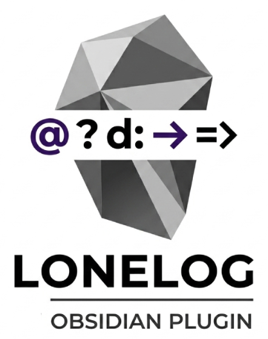

# Lonelog for Obsidian  - Solo TTRPG Journaling
[](https://obsidian.md/plugins)
[](https://github.com/snifer/lonelog/releases)
[](LICENSE)

[](https://ko-fi.com/bastiondeldino)


**Lonelog for Obsidian** streamlines your solo TTRPG journaling by bringing the [Lonelog notation](https://zeruhur.itch.io/lonelog) standard directly into your vault. Focus on the story while keeping mechanics organized, visual, and fast. **Fully compatible with Lonelog 1.4.0 system.**

**Lonelog para Obsidian** optimiza el registro de tus partidas de rol en solitario (Solo TTRPG) integrando el estándar de [notación Lonelog](https://zeruhur.itch.io/lonelog) directamente en tu bóveda. Céntrate en la historia mientras mantienes las mecánicas organizadas, visuales y ágiles. **Soporte completo para el sistema Lonelog 1.4.0.**

---

## Funcionalidades Principales

### 1.  Sistema de Notación Inteligente
Inserción rápida de los símbolos base de Lonelog mediante la paleta de comandos o atajos personalizados:

```
- `@` Action / Acción
- `?` Oracle Question / Pregunta de Oráculo
- `d:` Dice Roll / Tirada de Dados
- `->` Result / Resultado
- `=>` Consequence / Consecuencia
- `[Tag:Name|Attributes]` Entity Tags (NPCs, Locations, PCs, etc.) / Etiquetas de Entidad.
```

### 2. Gestión de Campaña y Sesiones

**Cabeceras Automáticas**: Inserta las cabeceras para registrar una campaña y sesión al instante.
**Marcadores de Escena**: Numeración automática de escenas con avisos opcionales de contexto.
 **Bloques de Código**: Engbloba tus registros en bloques `lonelog` para un renderizado mejorado.

 ```lonelog
@ El personaje
d: 1d6 -> 5
-> Sucede algo sospechoso.
 ```

### 3. Mejoras visuales

**Resaltado de Sintaxis**: Código de colores en tiempo real en Live Preview y modo lectura formateado.
**Personalización Total**: Control total de colores para cada símbolo desde el panel de ajustes.
**Paneles Laterales**: Vistas dedicadas en panel derecho específico para:

- **Relojes/Tracks de progreso**
- **Hilos de historia/NPCs** 
- **Navegación de escenas**.

### 4.  Extensiones Avanzadas 
Actualmente se esta dando soporte para mecánicas especializadas de Lonelog:

- **Combate**: Seguimiento de rondas, bloques de combate y etiquetas de enemigos.
- **Exploración de Mazmorras**: Seguimiento del estado de habitaciones y resúmenes de mazmorra.
 **Gestión de Recursos**: Control de inventario y riqueza.

### 5. Otras funciones 

-  **Autocompletado**: Sugerencias inteligentes de etiquetas basadas en entidades mencionadas anteriormente.
- **Internacionalización**: Totalmente localizado en Inglés y Español.

---

## Instalación

### BRAT (recommended for beta testing)
1. Instala el plug-in BRAT 
2. En configuraciones de  BRAT settings, click en Add Beta Plugin
3. Ingresa [https://github.com/Snifer/lonelog](https://github.com/Snifer/lonelog)
4. Habilita Lonelog  en Configuraciones > Plugins Comunitarios


### Instalación Manual (Desarrollo)
1. Este plugin se encuentra en desarrollo activo.
2. Clona o mueve los archivos de release a la carpeta de tu bóveda: `.obsidian/plugins/lonelog/`.
3. Actualiza los plugins en Obsidian 
4. Habilita **Lonelog** en **Ajustes → Plugins de la comunidad**.

### Desde Plugins de la Comunidad
*Coming Soon / Próximamente*


---

## Uso

1. Abre cualquier nota.
2. Presiona `Ctrl/Cmd + P` para abrir la paleta de comandos.
3. Escribe **"Lonelog"** para ver todos los comandos de inserción y gestión disponibles.
4. (Recomendado) Asigna atajos de teclado para un registro más rápido en **Ajustes → Atajos de teclado**.


**English Description**

## Funcionalidades Principales

### 1. Smart Notation System 
Quickly insert Lonelog core symbols using the Command Palette or custom hotkeys:

- `@` Action / Acción
- `?` Oracle Question / Pregunta de Oráculo
- `d:` Dice Roll / Tirada de Dados
- `->` Result / Resultado
- `=>` Consequence / Consecuencia
- `[Tag:Name|Attributes]` Entity Tags (NPCs, Locations, PCs, etc.) / Etiquetas de Entidad.

### 2. Campaign & Session Management 
- **Automatic Headers**: Insert campaign and session structure instantly. 
- **Scene Markers**: Automatic scene numbering with optional context prompts.
- **Code Blocks**: Wrap your logs in `lonelog` blocks for enhanced rendering. 

### 3. Interface 

- **Syntax Highlighting**: Real-time color coding in Live Preview and formatted Reading Mode.  
- **Total Customization**: Full control over colors for every symbol via the settings panel. 
- **Side Panels**: Dedicated views for **Progress Tracks/Clocks**, **Story Threads/NPCs**, and **Scene Navigation**. 

### 4. Add-ons Integrated
Full support for specialized Lonelog mechanics: 
- **Combat**: Round tracking, combat blocks `[COMBAT]`, and Foe tags `[F:]`. 
- **Dungeon Crawling**: Room state tracking `[R:]` and dungeon status snapshots. 
- **Resource Tracking**: Inventory  and Wealth management. 

### 5.  Other functions
- **Autocomplete**: Intelligent suggestions for tags based on previously mentioned entities. 
- **I18n**: Fully localized in English and Spanish. 

---

## Installation 

### BRAT (recommended for beta testing)
1. Install the BRAT plugin
2. In BRAT settings, click Add Beta Plugin
3. Enter [https://github.com/Snifer/lonelog](https://github.com/Snifer/lonelog)
4.Enable lonelog in Settings > Community Plugins

### Manual Installation (Development) /
1. This plugin is in active development, and compile 
2. Clone or move the plugin files into your vault's folder: `.obsidian/plugins/lonelog/`. 
3. Reload Obsidian. 
4. Enable **Lonelog** in **Settings → Community Plugins**. 


### From Community Plugins / Desde Plugins de la Comunidad
*Coming Soon / Próximamente*


---

## 📖 Usage 

1. Open any note.
2. Press `Ctrl/Cmd + P` to open the command palette. 
3. Type **"Lonelog"** to see all available insertion and management commands. 
4. (Recommended) Assign hotkeys for faster logging in **Settings → Hotkeys**. 


---

## 💻 Development / Desarrollo

```bash
# Install dependencies / Instalar dependencias
npm install

# Build (watch mode) / Compilar (modo observación)
npm run dev

# Production build / Compilar para producción
npm run build
```

---

## 📄 License / Licencia

This plugin is licensed under the **0-BSD License**. See [LICENSE](LICENSE) for details.
The Lonelog notation system is © 2025-2026 Roberto Bisceglie, licensed under **CC BY-SA 4.0**.

Este plugin está bajo la licencia **0-BSD**. Consulta [LICENSE](LICENSE) para más detalles.
El sistema de notación Lonelog es © 2025-2026 Roberto Bisceglie, bajo licencia **CC BY-SA 4.0**.

---

## ¿Disfrutas usando Lonelog en Obsidian? ☕
Si este proyecto te aporta valor en tus mesas de juego, puedes apoyar al desarrollador con una donación por PayPal  ¡Gracias por ayudar a que el proyecto siga creciendo!

## Enjoying Lonelog for Obsidian? ☕
If this project adds value to your gaming table, you can support the developer with a donation via PayPal. Thank you for helping the project keep growing!

[](https://paypal.me/sniferl4bs)


## 🖤 Credits / Créditos

- **Original Plugin Author / Autor Original del Plugin**: Chris Hardiman
- **Current Development / Desarrollado actual:** [Snifer](https://www.youtube.com/@BastiondelDinosaurio) [Bastion del Dinosaurio](https://www.youtube.com/@BastiondelDinosaurio)
- **Lonelog System / Sistema Lonelog**: [Roberto Bisceglie](https://zeruhur.itch.io/lonelog)
- **Design Philosophy / Filosofía de Diseño**: Inspired by the Valley Standard and modern Solo TTRPG practices. / Inspirado en el Valley Standard y prácticas modernas de Solo TTRPG.

